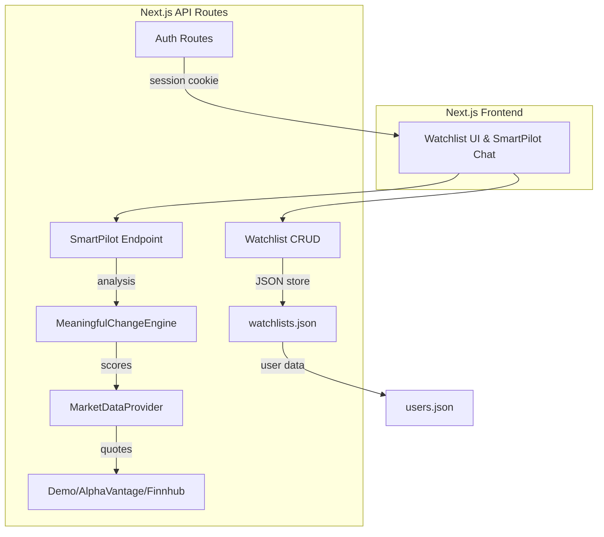

# SmartPilot Watch

**Tagline:** "Don’t just watch the market. Know what changed."

---

## 🚀 Overview

Traditional watchlists show a list of stocks with price and percentage changes, leaving users to figure out *why* a move matters. **SmartPilot Watch** adds an intelligence layer that:

1. Detects meaningful changes using a weighted scoring engine.
2. Provides concise, contextual explanations (price vs market/sector/peer, volume anomalies, events, etc.).
3. Lets users ask follow‑up questions in multiple languages.

The core user experience is a watchlist page where each symbol shows data freshness, and an **Ask SmartPilot** entry point for natural‑language queries.

---

## ✨ Key Features

- **Watchlist Management** – Create, rename, delete, reorder watchlists and symbols (see `src/app/lib/watchlist-store.ts`).
- **Meaningful Change Engine** – Classifies each quote with a score, significance level, and status (fresh, delayed, stale, partial, unavailable) (`src/app/lib/meaningful-change-engine.ts`).
- **Welcome Back** – Shows a personalized welcome state on returning visits (`MeaningfulChangeEngine.buildWelcomeState`).
- **SmartPilot AI** – Multilingual market‑intelligence assistant powered by **GROQ** LLM (fallback deterministic answers when API key missing) (`src/app/api/smartpilot/route.ts`).
- **Market Data Integration** – Demo data + optional AlphaVantage / Finnhub providers, unified via a composite provider (`src/app/lib/market-data.ts`).
- **Multilingual Support** – Auto‑detects Hindi, Marathi, Bengali, Tamil, Telugu, Kannada, Malayalam, and falls back to English.
- **Authentication** – Email/password credentials, Google OAuth, OTP users, with secure session cookies (`src/app/api/auth/credentials/route.ts` & `src/app/lib/auth-store.ts`).
- **Persistence** – JSON file store for users (`.data/users.json`) and watchlists (`data/watchlists.json`).
- **Rich UI** – Glass‑like components, animated 3D cards, and status dots (see `components/` folder).

---

## 🧠 How It Works



---

## 🎯 Meaningful Change Engine

Implemented in `src/app/lib/meaningful-change-engine.ts`.

- **Inputs** (`MeaningfulChangeInput`): price change %, market/sector/peer change %, volume ratio, historical Z‑score, event signal, user relevance, data status flags.
- **Scoring**: Each signal is weighted (price 20, historical 15, volume 15, market‑relative 15, sector‑relative 10, peer‑relative 10, event 10, relevance 5). Scores are clamped and combined.
- **Thresholds**: ≥ 80 → **CRITICAL**, ≥ 60 → **HIGH**, ≥ 15 → **MODERATE**, otherwise **LOW**.
- **Status** determination (`getStatus`) based on data availability flags (`UNAVAILABLE`, `PARTIAL`, `STALE`, `DELAYED`, `FRESH`).
- **Meaningful** if score ≥ 15 and status is not `UNAVAILABLE`, `STALE`, or `DELAYED`.
- Provides a human‑readable `summary` for UI and AI.

---

## 👋 Welcome Back

`MeaningfulChangeEngine.buildWelcomeState` creates a `WelcomeState` with a title/message, counts of meaningful/minor changes, and the last visit timestamp. The watchlist page can display a personalized greeting for returning users.

---

## 🤖 SmartPilot AI

- **Provider**: GROQ API (`GROQ_API_KEY`, `GROQ_MODEL` from `.env`).
- **Prompt**: Structured JSON of the analysis is sent to the model with system instructions to answer in the detected language.
- **Fallback**: Deterministic answers (`answerFor`) are used when the API key is missing or the model fails.
- **Supported languages**: English (`en`), Hindi (`hi`), Marathi (`mr`), Bengali (`bn`), Tamil (`ta`), Telugu (`te`), Kannada (`kn`), Malayalam (`ml`).

---

## 📊 Market Data

`src/app/lib/market-data.ts` defines `MarketDataProvider` with methods for quotes, historical data, company profiles, and symbol search.

- **Demo provider** – Static demo quotes for a handful of Indian stocks.
- **AlphaVantageProvider** – Live quotes via Alpha Vantage (requires `ALPHAVANTAGE_API_KEY`).
- **FinnhubProvider** – Live quotes via Finnhub (requires `FINNHUB_API_KEY`).
- **Composite provider** – Tries Finnhub → AlphaVantage → Demo.

Data fields include price, change %, volume, sector, peers, freshness, and optional signals (historical Z‑score, event, user relevance).

---

## 🗺️ Market Map

3D visual components (`MarketParticles.tsx`, `Hero3D.tsx`, `DashboardCards3D.tsx`) render a stylized market map using **Three.js** (`three`) and optional **React‑Three‑Fiber** (`@react-three/fiber`). These are used in the dashboard and landing pages.

---

## 🧪 What‑If Lab

The AI endpoint recognises phrases like *"what if"* or *"scenario"* and returns a simulated description based on the top‑scoring symbol, clearly marking the result as a *simulation* not a recommendation.

---

## 🎙️ Voice & Multilingual Support

- Language detection via regex patterns for Hindi, Marathi, Bengali, Tamil, Telugu, Kannada, Malayalam.
- Localised fallback answers for all supported languages (see `localizeFallback` in `smartpilot/route.ts`).
- Speech‑to‑text / text‑to‑speech UI is not part of the current codebase, so not documented.

---

## 🔐 Authentication

Implemented in `src/app/api/auth/credentials/route.ts` and `src/app/lib/auth-store.ts`.

- **Credentials flow** – Sign‑up or sign‑in with email/password.
- **Password hashing** – PBKDF2 via `crypto.scrypt` with per‑user salt.
- **Session** – Cookie `smartpilot_session` (HTTP‑only, SameSite lax, 7‑day TTL).
- **Google OAuth** – `upsertGoogleUser` helper (client IDs via env vars).
- **OTP / Email** – `findOrCreateOtpUser` placeholder for future OTP flow.

---

## 🗄️ Database & Persistence

- **Users** – Stored in `.data/users.json` (email, name, hashed password, provider info).
- **Watchlists** – Stored in `data/watchlists.json` (userId, defaultWatchlistId, list of watchlists with symbols and timestamps).
- Simple JSON file store is sufficient for the hackathon prototype.

---

## 🏗️ Architecture

```
Next.js (frontend & API)
│
├─ UI components (React, Tailwind, Three.js)
│
├─ API routes (auth, watchlist, smartpilot)
│   ├─ Business logic (auth‑store, watchlist‑store)
│   └─ Services (market‑data, meaningful‑change‑engine)
│
└─ Persistence (JSON files on disk)
```

---

## 🛠️ Tech Stack

- **Framework**: Next.js 16 (React 19, TypeScript)
- **Styling**: Tailwind CSS (dev dependency) + custom CSS
- **3D / Visualization**: three, @react-three/fiber (optional), @react-three/drei
- **State / Animations**: framer‑motion
- **Icons**: lucide‑react
- **AI**: GROQ (LLM) – `llama-3.3-70b-versatile`
- **Market Data**: Alpha Vantage, Finnhub, demo static data
- **Auth**: Credentials, Google OAuth, OTP placeholder
- **Persistence**: JSON files (`.data/users.json`, `data/watchlists.json`)

---

## 📦 Getting Started

```bash
# 1️⃣ Clone the repository
git clone https://github.com/Harshi-max/Smart-Market-Watchlist.git
cd Smart-Market-Watchlist

# 2️⃣ Install dependencies
npm install

# 3️⃣ Set up environment variables
cp .env.example .env
# Edit .env and fill in any required keys (e.g., GROQ_API_KEY, ALPHAVANTAGE_API_KEY)

# 4️⃣ Run the development server
npm run dev
# Open http://localhost:3000 in your browser
```

### Database setup
The repository uses a simple JSON‑file store; no migration steps are required. The first run will create `data/watchlists.json` and `.data/users.json` with demo data.

### Production build (optional)
```bash
npm run build   # Next.js production build
npm start       # Start the production server
```

---

## 🔑 Environment Variables

| Variable | Purpose | Required |
|---|---|---|
| `DATABASE_URL` | SQLite URL for local dev (PostgreSQL in production) | ✅ |
| `MARKET_DATA_PROVIDER` | Selects provider (`demo`, `alphavantage`, `finnhub`) – leave empty for auto selection | ❌ |
| `MARKET_DATA_API_KEY` | Generic market data API key (fallback) | ❌ |
| `ALPHAVANTAGE_API_KEY` | Alpha Vantage API key | ❌ |
| `FINNHUB_API_KEY` | Finnhub API key | ❌ |
| `GROQ_API_KEY` | GROQ LLM API key (enables AI) | ❌ |
| `GROQ_MODEL` | Model identifier (default: `llama-3.3-70b-versatile`) | ❌ |
| `GOOGLE_CLIENT_ID` / `GOOGLE_CLIENT_SECRET` / `GOOGLE_CALLBACK_URL` | Google OAuth configuration | ❌ |
| `RESEND_API_KEY` / `RESEND_FROM_EMAIL` | Email sending (placeholder) | ❌ |
| `SMTP_HOST`, `SMTP_PORT`, `SMTP_USER`, `SMTP_PASS`, `SMTP_FROM_EMAIL` | SMTP configuration for email (not used in core demo) | ❌ |

Never commit real credentials.

---

## 🌐 Live Demo
Add deployment URL here (e.g., Vercel preview link) if available.

---

## 📁 Project Structure

```
src/
├─ app/
│   ├─ api/
│   │   ├─ auth/
│   │   ├─ smartpilot/
│   │   └─ watchlist/
│   ├─ components/   # UI widgets and 3D visualisations
│   ├─ lib/          # auth‑store, market‑data, meaningful‑change‑engine, watchlist‑store, language‑config
│   ├─ dashboard/
│   ├─ landing.css
│   ├─ page.tsx      # landing page
│   └─ watchlist/
│       └─ page.tsx  # watchlist UI
├─ components/       # shared 3D components
├─ public/           # static assets
├─ .env.example
├─ package.json
└─ next.config.ts
```

---

## 🧪 Testing

```bash
npm run test   # Runs TypeScript test files (e.g., meaningful-change-engine.test.ts)
npm run lint   # Lints the codebase
```

---

## ⚡ Performance & Reliability

- **Caching** – Market data providers are called per request; demo data is in‑memory.
- **Graceful degradation** – If a provider fails, the composite provider falls back to the next one, ultimately serving demo data.
- **Error handling** – API routes return proper HTTP status codes for missing data or invalid input.
- **Rate limiting** – Not implemented yet; rely on provider limits.
- **Loading states** – UI components show freshness indicators and loading spinners.

---

## 🛡️ Data & Safety

- Stale or delayed market data is flagged (`STALE`, `DELAYED`) and excluded from AI‑generated "meaningful" signals.
- The AI is instructed **never to invent** market data; it only references the structured `analysis` payload.
- All user‑provided credentials are stored hashed; session cookies are HTTP‑only.

---

## 🎯 Why SmartPilot Watch?

- **Traditional watchlist**: *What moved?*
- **SmartPilot Watch**: *What moved meaningfully, why does it matter, and what should I look at next?*

By surfacing only the most significant moves and offering AI‑driven context, users can focus on actionable insights instead of noise.

---

## 🏆 Challenge Alignment

- **Watchlist creation & management** – Fully implemented via API and UI.
- **Latest market information** – Integrated market data providers with freshness status.
- **Return later & understand what changed** – Welcome back state and meaningful‑change scoring.
- **Define meaningful change** – Weighted engine with configurable thresholds.
- **Market/sector‑wide movement handling** – Relative‑to‑market/sector/peer scores.
- **Persist user state** – JSON stores for users and watchlists.
- **Stale/delayed data handling** – Status flags and AI exclusions.
- **Scalable** – Composite provider pattern allows adding more data sources.

---

## ⚠️ Disclaimer

SmartPilot Watch is for informational and educational purposes only. It does **not** provide financial advice, recommendations, or predictions. Always conduct your own research before making investment decisions.

---

## 👩💻 Built For

CODE 2026 / Groww Engineering Build Challenge

**SmartPilot Watch** – "Don’t just watch the market. Know what changed."

